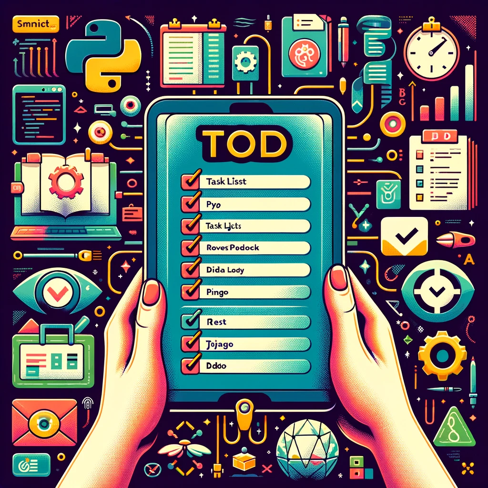

# Detailed Todo App


## Overview
This Django Todo Application is a user-centric task management system, allowing registered users to create, manage, and personalize their todo lists and categories. The application ensures privacy and personalization by displaying only the content created by the logged-in user.

Features
- User Authentication: Users can sign up for a new account and log in to access their todos and categories.
- Private Todo Lists: Each user can only access and manage their own todos and categories, ensuring data privacy.
- Personalized User Profiles: Users have their own profile pages, which they can customize with an avatar and personal information.
- Todo Management: Users can create, edit, and delete their todos and categorize them for better organization.
- Detailed Todo View: Each todo has a detail page showing the author, title, content, and options to edit or delete.
- Responsive Design: The application is fully responsive and accessible on various devices and screen sizes.
- REST API: The application includes REST API. Every user can use api and create, update, delete, list both todos and todo categories via api. Once user created, their token automatically created to use REST API. Client need to use tokens to use api.


## Todo Rest API Endpoints

### Todo Endpoints
- **List Todos**: `/api/todo/` - List all todos or create a new todo.
- **Todo Details**: `/api/todo/<id>/` - View details of a specific todo.
- **Delete Todo**: `/api/todo/<id>/delete/` - Delete a single todo.
- **Update Todo**: `/api/todo/<id>/update/` - Update a single todo.
- **Filter Todos by Category**: `/api/todo/<category_name>/` - Filter todos according to their category.

### Category API Endpoints

- **List Categories**: `/api/category/` - List all categories or create a new category.
- **Category Details**: `/api/category/<id>/` - View details of a specific category.
- **Delete Category**: `/api/category/<id>/delete/` - Delete a single category.
- **Update Category**: `/api/category/<id>/update/` - Update a single category.

### API GET or Create Token Endpoint

- **Get or Create Token**: `/api/token/` - Get or Create Token for You to Use API. Use username and password and make POST request to get the token.


## Project Setup

Follow these steps to set up the project:

**Step 1**: Clone the project
```bash
git clone https://github.com/oskaygunacar/Django-todo-app-project.git
```

**Step 2**: Navigate to the directory
```bash
cd Django-todo-app-project
```

**Step 3**: Create and activate a virtual environment
```bash
# Create
python -m venv env

# Activate for MacOS & Linux
source env/bin/activate

# Activate for Windows
env\Scripts\activate
```

**Step 4**: Install dependencies
```bash
pip install -r requirements.txt
```

**Step 5**: Migrate the database and create a superuser
```bash
python manage.py migrate
python manage.py createsuperuser
```

**Step 6**: Run the server
```bash
python manage.py runserver
```

After completing these steps, you should be able to access the project by visiting `127.0.0.1:8000` in your browser.